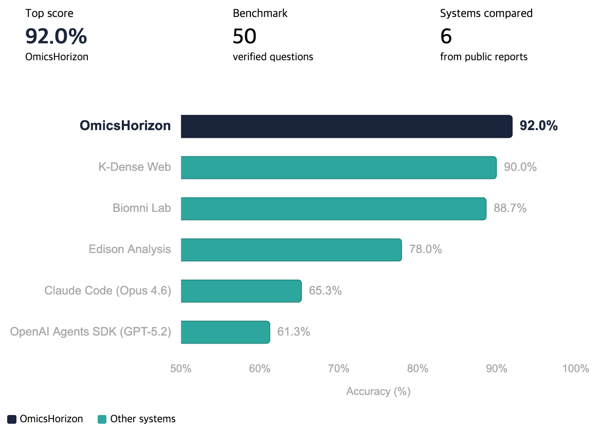

# SciAgent-Skills

## Benchmark: 92.0% on BixBench-Verified-50

<p align="center">
  
</p>

**OmicsHorizon**, powered by SciAgent-Skills, achieved **92.0% accuracy** on the BixBench-Verified-50 benchmark — outperforming all other systems compared. Notably, Claude Code (Opus 4.6) without skills scores 65.3%, but jumps to 92.0% simply by equipping it with these domain-specific skills (**+26.7%p**).

## Try It Now

Want to try these skills without any setup? **[OmicsHorizon](https://omicshorizon.ai/en/)** lets you use SciAgent-Skills directly in your browser — just sign up and start analyzing.

---

**196 ready-to-use scientific skills for AI coding agents** — covering genomics, proteomics, drug discovery, biostatistics, scientific computing, and scientific writing.

Each skill is a self-contained SKILL.md file with runnable code examples, key parameters, troubleshooting guides, and best practices. Designed for [Claude Code](https://docs.anthropic.com/en/docs/claude-code), but compatible with any agent that reads markdown skill files.

## What's Inside

| Category | Skills | Examples |
|----------|:------:|----------|
| Genomics & Bioinformatics | 63 | Scanpy, BioPython, pysam, gget, KEGG, PubMed, scvi-tools |
| Structural Biology & Drug Discovery | 26 | RDKit, AutoDock Vina, ChEMBL, PDB, DeepChem, datamol |
| Scientific Computing | 24 | Polars, Dask, NetworkX, SymPy, UMAP, PyG, Zarr, SimPy |
| Cell Biology | 15 | pydicom, histolab, FlowIO |
| Biostatistics | 12 | scikit-learn, statsmodels, PyMC, SHAP, survival analysis |
| Scientific Writing | 21 | Manuscript writing, peer review, LaTeX posters, slides, figure guides |
| Systems Biology & Multi-omics | 11 | COBRApy, LaminDB, Reactome, STRING |
| Proteomics & Protein Engineering | 10 | ESM, UniProt, PyOpenMS, matchms, HMDB |
| Lab Automation | 6 | Opentrons, Benchling |
| Data Visualization | 5 | Plotly, Seaborn |
| Molecular Biology | 3 | CRISPR sgRNA design, gene expression, cloning |

**Skill types:** 72 toolkits, 53 database connectors, 36 guides, 35 pipelines

## Installation

### Prerequisites

- [Claude Code](https://docs.anthropic.com/en/docs/claude-code) CLI installed
- Git
- Python 3.12+ (only needed if you want to run validation scripts)

### Step 1: Clone the Repository

```bash
git clone https://github.com/jaechang-hits/SciAgent-Skills.git
cd SciAgent-Skills
```

### Step 2: Choose Your Setup Method

#### Method A: Claude Code Plugin (Recommended)

Load SciAgent-Skills as a Claude Code plugin for the current session:

```bash
claude --plugin-dir /path/to/SciAgent-Skills
```

To verify the plugin loaded, run `/plugin` inside Claude Code and check that `sciagent-skills` appears in the Installed tab.

Skills become available as `/sciagent-skills:<skill-name>`:

```
/sciagent-skills:scanpy-scrna-seq
/sciagent-skills:rdkit-cheminformatics
/sciagent-skills:pymc-bayesian-modeling
```

Or just describe your task — the agent finds the relevant skill automatically:

> "Perform differential expression analysis on this RNA-seq count matrix"

**Persistent installation** — to load the plugin automatically in every session, use the plugin install command inside Claude Code:

```
/plugin marketplace add jaechang-hits/SciAgent-Skills
/plugin install sciagent-skills
```

#### Method B: Project-Level Integration

Clone into your project directory so Claude Code picks up skills via `CLAUDE.md`:

```bash
cd your-project
git clone https://github.com/jaechang-hits/SciAgent-Skills.git .sciagent-skills
```

Add to your project's `CLAUDE.md`:

```markdown
## Scientific Skills
Reference skills in `.sciagent-skills/skills/` for domain-specific analysis.
Registry: `.sciagent-skills/registry.yaml`
```

### Step 3: Install Dependencies

```bash
cd SciAgent-Skills
pixi install
```

[Pixi](https://pixi.sh) handles the Python environment and all required packages. If you don't have pixi installed:

```bash
curl -fsSL https://pixi.sh/install.sh | bash
```

## How Skills Work

Each skill follows a structured template:

```
skills/<category>/<skill-name>/
  SKILL.md          # Main skill file (300-550 lines)
  references/       # Optional deep-dive reference files
  assets/           # Optional templates, configs
```

A **SKILL.md** contains:

- **Frontmatter** — name, description, license (for agent discovery)
- **Overview & When to Use** — what the tool does and when to reach for it
- **Prerequisites** — packages, data, environment setup
- **Quick Start** — minimal copy-paste example
- **Workflow / Core API** — step-by-step pipeline or module-by-module API guide
- **Key Parameters** — tunable settings with defaults and ranges
- **Common Recipes** — self-contained snippets for common tasks
- **Troubleshooting** — problem/cause/solution table

The agent reads only the `description` field during planning. Full skill content is loaded on demand when relevant.

## Directory Structure

```
SciAgent-Skills/
├── .claude-plugin/
│   └── plugin.json        # Claude Code plugin manifest
├── skills/                 # All 196 skills organized by category
│   ├── genomics-bioinformatics/
│   ├── structural-biology-drug-discovery/
│   ├── scientific-computing/
│   ├── cell-biology/
│   ├── biostatistics/
│   ├── scientific-writing/
│   ├── systems-biology-multiomics/
│   ├── proteomics-protein-engineering/
│   ├── lab-automation/
│   ├── data-visualization/
│   └── molecular-biology/
├── templates/              # Skill authoring templates
├── registry.yaml           # Index of all skills
├── CLAUDE.md               # Skill authoring guide
└── scripts/
    └── validate_registry.py
```

## Example Use Cases

**Drug Discovery Pipeline**
> "Search ChEMBL for EGFR inhibitors with IC50 < 100nM, filter with Lipinski rules using RDKit, dock top candidates with AutoDock Vina"

Uses: `chembl-database-bioactivity` → `rdkit-cheminformatics` → `autodock-vina-docking`

**Single-Cell RNA-seq Analysis**
> "Load 10X data, QC filter, normalize, cluster, find marker genes, and annotate cell types"

Uses: `anndata-data-structure` → `scanpy-scrna-seq`

**Bayesian Biostatistics**
> "Fit a hierarchical Bayesian model to this clinical trial data with patient-level random effects"

Uses: `pymc-bayesian-modeling` → `matplotlib-scientific-plotting`

**Protein Structure Analysis**
> "Get the AlphaFold structure for UniProt P04637, assess confidence, find high-confidence binding regions"

Uses: `uniprot-protein-database` → `alphafold-database-access`

## Contributing

### Adding a New Skill

1. Read `CLAUDE.md` for the full authoring workflow
2. Classify your topic (pipeline / toolkit / database / guide)
3. Pick a category from the table above
4. Use the appropriate template from `templates/`
5. Add the entry to `registry.yaml`
6. Validate: `python scripts/validate_registry.py`

### Skill Templates

| Template | Use When |
|----------|----------|
| `SKILL_TEMPLATE.md` | Linear input→process→output pipeline (e.g., DESeq2) |
| `SKILL_TEMPLATE_TOOLKIT.md` | Collection of independent modules (e.g., RDKit) |
| `SKILL_TEMPLATE_PROSE.md` | Conceptual guide, decision frameworks (e.g., statistical test selection) |

## Requirements

- Python 3.12+ (for validation scripts)
- No runtime dependencies — skills are markdown files read by the agent
- Individual skills list their own tool-specific prerequisites (e.g., `pip install scanpy`)

## License

CC-BY-4.0 for original content. Individual skills note the license of their underlying tools.

## Acknowledgments

This project builds on 50+ open-source scientific Python packages. If you find a skill useful, consider starring the underlying tool's repository and supporting its maintainers.

